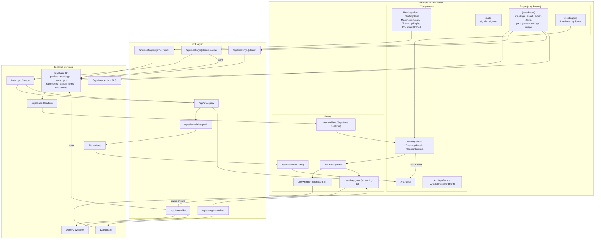

# Aria — AI Meeting Intelligence Platform

Aria is an in-person AI meeting assistant that listens silently, transcribes speech in real-time, responds to voice queries ("Hey Aria"), and delivers summaries and action items after every meeting.

## Stack

| Layer | Technology |
|---|---|
| Framework | Next.js 16 (App Router) |
| UI | Tailwind CSS + shadcn/ui |
| Database & Auth | Supabase (PostgreSQL, Auth, RLS, Realtime) |
| Transcription | OpenAI Whisper + Deepgram (real-time) |
| AI Intelligence | Anthropic Claude |
| Text-to-Speech | ElevenLabs |
| Hosting | Vercel |

## Architecture



## Key Flows

**Live meeting**
Browser mic → `use-realtime` → `/api/transcribe` (Whisper) → Supabase DB → Supabase Realtime → all participants' transcript feeds in real time.

**Hey Aria (wake word)**
Wake word detected client-side → `AriaPanel` → `/api/aria/query` → Claude → `/api/elevenlabs/speak` → audio response played back.

**Post-meeting**
`/api/meetings/[id]/summarise` → pulls transcripts from DB → Claude generates summary + action items → saved back to DB → visible in meeting detail page.

**Auth & roles**
`proxy.ts` guards all dashboard routes. Two roles via Supabase Auth: `admin` (sees all meetings, manages team) and `member` (sees only their meetings). Row-level security enforced at the DB layer.

## Project Structure

```
src/
├── app/
│   ├── (auth)/            — Sign in / Sign up
│   ├── (dashboard)/       — Authenticated pages
│   │   ├── meetings/      — List, detail, create, edit
│   │   ├── meeting/[id]/  — Live meeting room
│   │   ├── action-items/  — Action items tracker
│   │   ├── participants/  — Team management
│   │   ├── settings/      — API keys, password
│   │   └── usage/         — Token usage
│   └── api/               — Route handlers
├── components/
│   ├── meeting-room/      — Live room UI
│   ├── meetings/          — Meeting cards, forms, summaries
│   ├── participants/      — Team table
│   ├── settings/          — Settings forms
│   └── ui/                — shadcn/ui primitives
├── hooks/                 — Audio, transcription, TTS hooks
├── lib/
│   ├── actions/           — Server Actions
│   ├── supabase/          — Supabase client instances
│   └── types/             — Shared TypeScript types
└── proxy.ts               — Auth middleware
```

## Getting Started

1. Install dependencies:

```bash
pnpm install
```

2. Copy `.env.example` to `.env.local` and fill in:

```
NEXT_PUBLIC_SUPABASE_URL=
NEXT_PUBLIC_SUPABASE_ANON_KEY=
```

3. Run Supabase migrations:

```bash
supabase db push
```

4. Start the dev server:

```bash
pnpm dev
```

Open [http://localhost:3000](http://localhost:3000).

## Database Migrations

Migrations live in `supabase/migrations/`:

| File | Description |
|---|---|
| `001_initial_schema.sql` | Core tables: profiles, meetings, participants, transcripts, documents, summaries, action items |
| `002_phase3_documents_and_storage.sql` | Document storage and Aria interactions |
| `003_token_usage.sql` | Token usage tracking |
